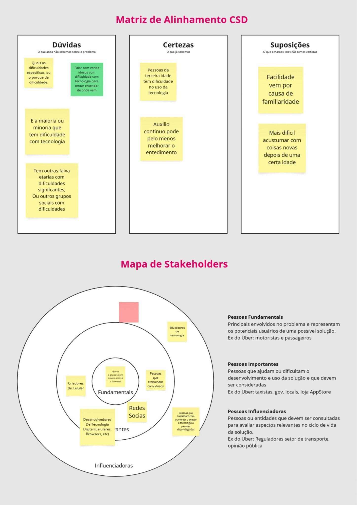
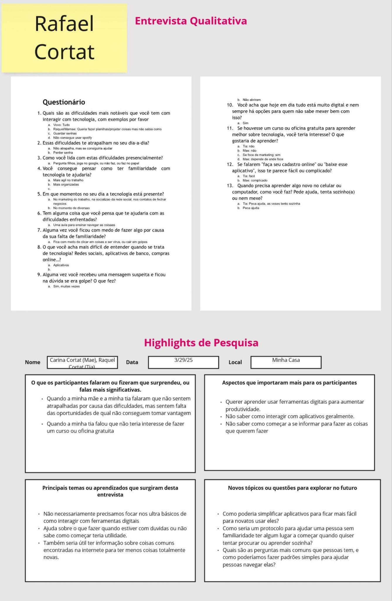
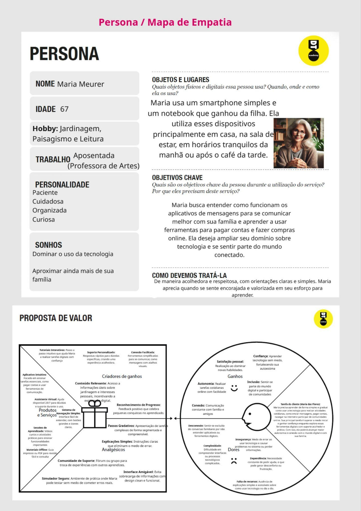
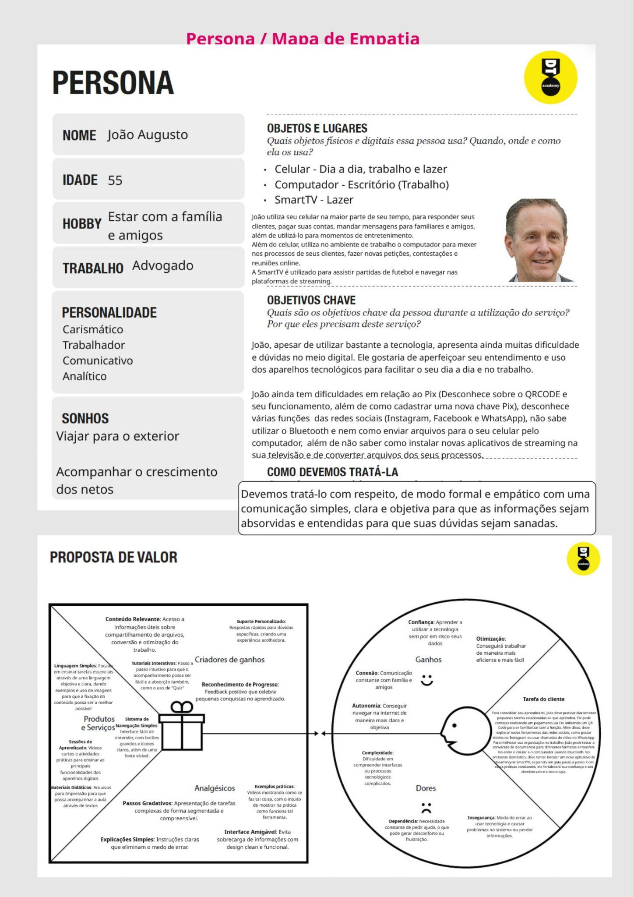
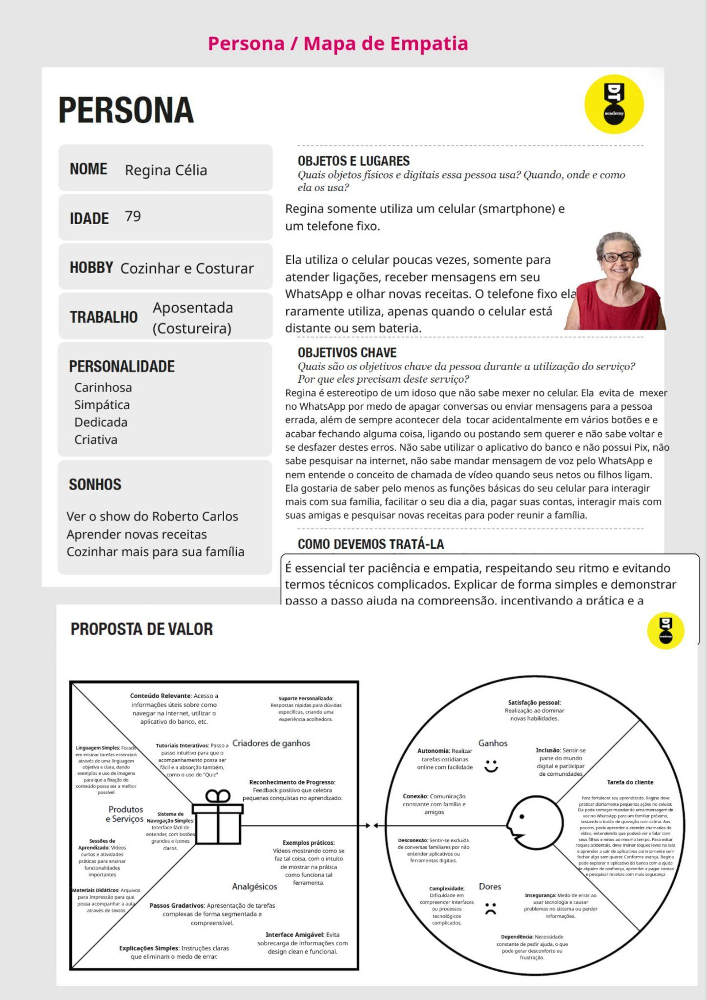
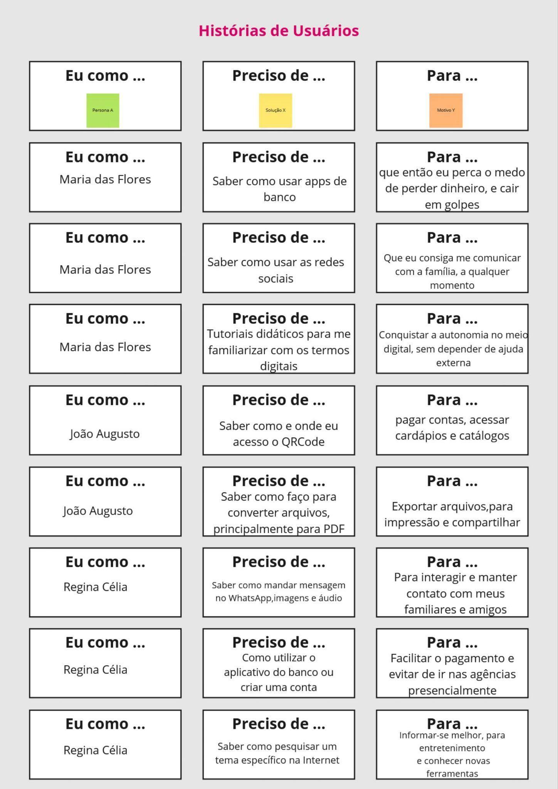

  # Introdução

  Informações básicas do projeto.

  * **Projeto:** Anafalbetismo Digital
  * **Repositório GitHub:** https://github.com/ICEI-PUC-Minas-PPLCC-TI/atividade-01-analfabetismo-digital
  * **Membros da equipe:**

    * [Rafael](https://github.com/SuperMegaCO) 
    * [Rodrigo](https://github.com/beltrano)

  A documentação do projeto é estruturada da seguinte forma:

  1. Introdução
  2. Contexto
  3. Product Discovery
  4. Product Design
  5. Metodologia
  6. Solução
  7. Referências Bibliográficas


  # Contexto

  Vivemos em uma era marcada pelo avanço acelerado da tecnologia e pela crescente
  digitalização dos serviços, das relações sociais e do acesso à informação. A internet e os
  dispositivos móveis se tornaram parte essencial do cotidiano, influenciando desde a forma
  como nos comunicamos até como realizamos tarefas básicas, como pagar contas, buscar
  entretenimento ou acessar serviços de saúde. No entanto, apesar da expansão do ambiente
  digital, grande parte da população ainda enfrenta dificuldades para acompanhar essas
  transformações, especialmente as pessoas mais velhas.

  Como parte da construção deste projeto, o grupo realizou entrevistas com familiares,
  conhecidos e cidadãos alheios , buscando compreender melhor essa realidade. A maioria dos
  entrevistados relatou dificuldade em lidar com tecnologias básicas, como criar uma conta
  online, acessar aplicativos de bancos ou realizar simples pesquisas na internet. Esses relatos
  confirmaram a importância e a urgência de um projeto voltado à educação digital

  Diante dessa realidade, o grupo escolheu abordar o analfabetismo digital, com foco no
  público idoso, desenvolvendo um website educativo que busca apresentar, de forma acessível,
  clara e didática, os principais recursos do mundo digital. O projeto contempla temas como a
  criação de contas em bancos digitais, o uso de redes sociais, o cadastro no Pix, o uso de QR
  Codes e até mesmo como assistir filmes pela internet.

  ## Problema

  O trabalho surgiu a partir da observação de que muitas pessoas, especialmente da
  terceira idade, enfrentam dificuldades para lidar com o mundo digital. Por não terem tido
  contato com a tecnologia desde cedo, esse público acaba tendo limitações para realizar tarefas
  simples, como usar redes sociais, aplicativos bancários ou assistir a um filme pela internet.

  Essa falta de familiaridade com ferramentas digitais gera não apenas insegurança, mas
  também afasta essas pessoas de uma vida mais autônoma, conectada e participativa. Diante
  disso, o grupo sentiu a necessidade de desenvolver um conteúdo acessível, que ajude esses
  usuários a entender e usar a tecnologia com mais confiança. Nossa motivação é mostrar que
  nunca é tarde para aprender, e que o ambiente digital pode ser um espaço de descobertas,
  comunicação e entretenimento, mesmo para quem está começando agora.


  ## Objetivos
  ### Objectivo Geral
  O objetivo geral do nosso projeto é promover a inclusão digital de pessoas
  que não tiveram contato com a tecnologia desde cedo, especialmente o público da terceira
  idade. Buscamos, por meio de um site educativo e acessível, ensinar de forma simples e clara
  como utilizar ferramentas básicas do mundo digital, como redes sociais, bancos digitais,
  plataformas de entretenimento e navegadores de internet. Nosso propósito é capacitar essas
  pessoas para que se sintam mais confiantes e independentes no uso da tecnologia, permitindo
  que se conectem, realizem tarefas do dia a dia com mais facilidade e aproveitem as diversas
  possibilidades que o ambiente digital oferece.  
  ### Objectivos Especificos
  a) Ensinar o uso básico das redes sociais, como criar contas, enviar mensagens, fazer
  publicações e interagir com amigos e familiares em plataformas como WhatsApp, Youtube e
  Instagram.
  b) Orientar o passo a passo para utilizar aplicativos de bancos digitais, incluindo como
  abrir uma conta, cadastrar o Pix, usar QR Codes e realizar operações bancárias com
  segurança.
  c) Apresentar formas de entretenimento digital acessível pelo celular, como assistir filmes e
  séries em plataformas de streaming (ex: Netflix), ouvir músicas, assistir vídeos e realizar
  buscas no Google.
  d) Desenvolver um site com linguagem simples e navegação intuitiva,
  especialmente pensado para pessoas que não têm familiaridade com o ambiente digital,
  facilitando o aprendizado e incentivando o uso autônomo da tecnologia.

  ## Justificativa

  Assim como mencionado anteriormente na introdução e no objetivo geral, o
  desenvolvimento deste projeto se justifica pela necessidade urgente de promover a inclusão
  digital de pessoas que não cresceram em contato com a tecnologia, especialmente idosos. Em
  um mundo cada vez mais conectado, onde o acesso a serviços, comunicação e entretenimento
  é feito, em grande parte, por meios digitais, não saber utilizar essas ferramentas básicas se
  torna um fator de exclusão social e dependência.
  A principal contribuição do trabalho é oferecer um site educativo, intuitivo e direto ao
  ponto, que ensina passo a passo como usar redes sociais, bancos digitais e plataformas de
  entretenimento, utilizando uma linguagem simples e visualmente clara. Ao fazer isso, o
  projeto ajuda essas pessoas a ganharem mais autonomia, confiança e conexão com o mundo à
  sua volta

  ## Público-Alvo

  O nosso publico alvo pode ser dividido em dois grupos: adultos de terceira idade que nao tem familiaridade com elementos basicos sobre a utilizacao de recursos digitais, e adultos de 40+ anos que conseguem utilizar recursos digitais em um nivel basico, mas nao sentem que entendem ou tem dominio suficiente para navegar com comfianca o mundo digital

# Product Discovery

## Etapa de Entendimento


  > 
  > !

  ## Etapa de Definição

  ### Personas

  
  
  

  # Product Design

  Nesse momento, vamos transformar os insights e validações obtidos em soluções tangíveis e utilizáveis. Essa fase envolve a definição de uma proposta de valor, detalhando a prioridade de cada ideia e a consequente criação de wireframes, mockups e protótipos de alta fidelidade, que detalham a interface e a experiência do usuário.

  ## Histórias de Usuários

  


  ## Requisitos

  As tabelas que se seguem apresentam os requisitos funcionais e não funcionais que detalham o escopo do projeto.

  ### Requisitos Funcionais

  | ID     | Descrição do Requisito                                |
  -------------------------------------------------------|------------|
  | RF-001 | Sistema de login e salvar informacao de usuario|
  | RF-002 | Sistema para mostrar todos os artigos, e pegar artigos do db.json e mostar-los como pagina|
  | RF-003 | Pagina inicial clara e organizada, com links para todos elementos do site importantes|
  | RF-004 | Pagina com videos, com os links does embeds pegados do db.json|


  ### Requisitos não Funcionais

  | ID      | Descrição do Requisito                                                          |
  ---------------------------------------------------------------------------------|------------|
  | RNF-001 | O sistema deve possuir uma interface simples e uma navegação fácil, com linguagem objetiva.
  | RNF-002 | Uso de imagens explicativas: as imagens devem ser claras, com botões direcionando para cada tópico, ajudando o usuário a identificar e repetir as ações no próprio dispositivo.
  | RNF-003 | Organização por tópicos: o conteúdo deve ser dividido em categorias claras (ex: redes sociais, bancos digitais, entretenimento) para facilitar a navegação.

  # Metodologia

  Detalhes sobre a organização do grupo e o ferramental empregado.

  ## Ferramentas

  Relação de ferramentas empregadas pelo grupo durante o projeto.

  | Ambiente                    | Plataforma | Link de acesso                                | Justificativa |
  |-----------------------------|------------|-----------------------------------------------|------------------|
  | Processo de Design Thinking | Miro       | https://miro.com/app/board/uXjVIIoT7-c=/?share_link_id=107439228508   |
  | Repositório de código       | GitHub     | https://github.com/ICEI-PUC-Minas-PPLCC-TI/atividade-01-analfabetismo-digital     |
  | Hospedagem do site          | Github Pages     |https://supermegaco.github.io/atividade-01-analfabetismo-hostiing/|
  | Editor de Codigo       | Visual Studio Code  || Usamos o visual studio code porque ja tinhamos familiaridade e tem varias funcionalidades poderosas para editar hrml e js.|
  |Applicativo de Communicacao | WhatsApp || Usamos o WhatsApp porque era a forma de comujnicacao mais familiar e conveniente para o grupo.|


  ## Gerenciamento do Projeto


  # Solução Implementada

  Esta seção apresenta todos os detalhes da solução criada no projeto.

  ## Vídeo do Projeto

  O vídeo a seguir traz uma apresentação do problema que a equipe está tratando e a proposta de solução. ⚠️ EXEMPLO ⚠️


  ## Funcionalidades

  Esta seção apresenta as funcionalidades da solução.Info

  ##### Funcionalidade 1 - Cadastro De Artigos

  Permite a inclusão, leitura, alteração e exclusão de artigos para o sistema

  * **Estrutura de dados:** Artigos
  * **Instruções de acesso:**
    * Abra o site e clica no botao 'Cadastrar'
    * Selecione o artigo que quer editar, ou o '+' para criar um novo.
    * Faz as mudancas e aperta submit.
  * **Tela da funcionalidade**:

  ##### Funcionalidade 2 - Apresentacao De Artigos

  Apresenta artigos do database a o usuario
  * **Estrutura de dados:** Artigos
  * **Instruções de acesso:**
    * Abra o site e clica no botao de ir nos artigos
    * Selecione o artigo que quer ver
  * **Tela da funcionalidade**:


  ##### Funcionalidade 3 - Login

  Permite login de usuario

  * **Estrutura de dados:** Usuarios
  * **Instruções de acesso:**
    * Abra o site, cadastre o seu usuario, e faz login.
  * **Tela da funcionalidade**:


  ## Estruturas de Dados

  Descrição das estruturas de dados utilizadas na solução com exemplos no formato JSON.Info

  ##### Estrutura de Dados - Artigos

  Artigos

  ```json
    "artigos": [
      {
        "id": "0",
        "titulo": "Artigo 1",
        "descricao": "Artigo teste",
        "Passos": [
          {
            "Imagem": "https://placehold.co/300x200?text=1",
            "TituloPasso": "Titulo Do Passo 1",
            "Numero": 1,
            "TextPasso": "Lorem ipsum dolor sit amet,"
          },
          {
            "Imagem": "https://placehold.co/300x200?text=2",
            "TituloPasso": "Titulo do Passo 2",
            "Numero": 2,
            "TextPasso": "Lorem ipsum dolor sit amet "
          }
        ]
      },]
    
  ```

  ##### Estrutura de Dados - Usuários  

  Registro dos usuários do sistema utilizados para login e para o perfil do sistema

  ```json
    "usuarios": [


      {


        "id": "e4c7",


        "login": "rafac",


        "senha": "220milrafa",


        "nome": "Rafael Cortat",


        "email": "rafacortat@gmail.com"


      }]
  ```


  ## Módulos e APIs
  **Database**
  * MyJsonServer - https://my-json-server.typicode.com/
  **Scripts:**

  * jQuery - [http://www.jquery.com/](http://www.jquery.com/) 
  * Bootstrap 4 - [http://getbootstrap.com/](http://getbootstrap.com/)


